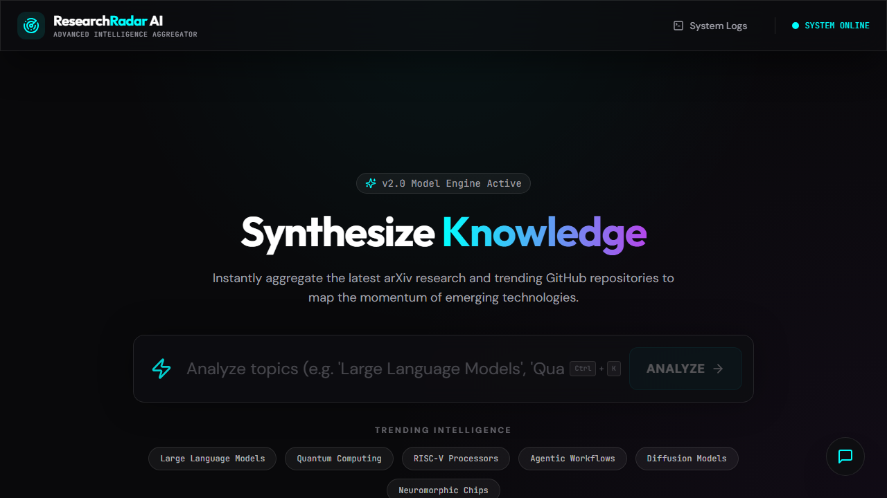
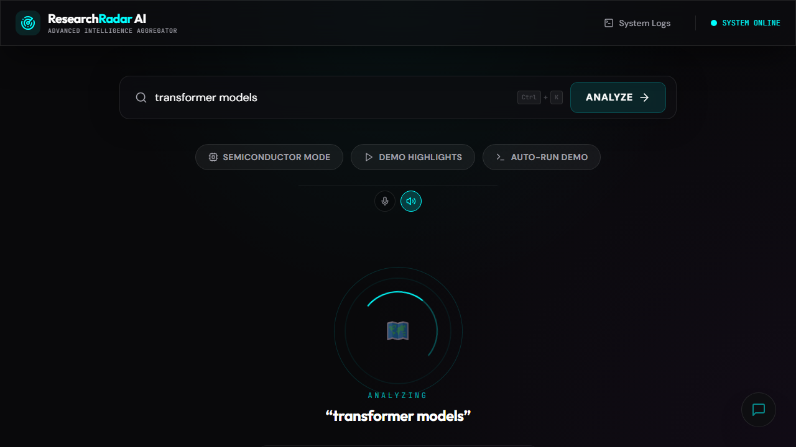

# Research-Radar-AI 🔭

> **AI-powered tech intelligence dashboard** — aggregate arXiv research papers + GitHub repositories for any topic and get instant strategic insights, trend analysis, and startup opportunity reports.

[](https://nodejs.org) [](https://www.typescriptlang.org) [](https://react.dev) [](LICENSE)

---

## ✨ Features

| Feature | Description |
|---|---|
| **Research Aggregation** | Pulls latest papers from arXiv API + top repos from GitHub |
| **AI Analysis** | Groq-powered summaries, insights, startup ideas, risk profiles |
| **Trend Scoring** | 0–100 momentum score + investment signal (LOW/MEDIUM/HIGH) |
| **Global Research Map** | World map showing research activity by country |
| **Semiconductor Mode** | Specialized VLSI/chip/RISC-V intelligence pipeline |
| **Strategic Intelligence** | Risk profile, adoption timeline, role-based recommendations |
| **Startup Opportunities** | 2 AI-generated startup ideas with problem/solution framing |
| **Search History** | localStorage-backed recent queries with keyboard shortcut |
| **URL Sync** | Shareable URLs via `?q=your-query` |
| **Voice Interface** | Browser speech synthesis + voice command input |
| **Export** | JSON/text export of full analysis |

---

## 🚀 Quick Start

### Prerequisites
- Node.js 20+
- npm 10+

### 1. Clone & Install

```bash
git clone https://github.com/your-username/research-radar-ai.git
cd research-radar-ai
npm install
```

### 2. Configure Environment

```bash
cp .env.example .env
```

Open `.env` and fill in your keys (see [Environment Variables](#environment-variables)).

### 3. Initialize Database

```bash
npm run db:push
```

This creates a local `sqlite.db` file — no PostgreSQL or external DB required.

### 4. Start Development Server

```bash
npm run dev
```

Open [http://localhost:5000](http://localhost:5000) 🎉

---

## 🖼️ Frontend Screenshots

| Home | Results |
|---|---|
|  |  |

---

## 🔑 Environment Variables

| Variable | Required | Description |
|---|---|---|
| `DATABASE_URL` | ✅ | SQLite file path. Use `file:sqlite.db` |
| `PORT` | Optional | Server port (default: 5000) |
| `NODE_ENV` | Optional | `development` or `production` |
| `GROQ_API_KEY` | Recommended | Powers AI summaries & insights. Without it, rule-based fallbacks are used |
| `GITHUB_TOKEN` | Recommended | Increases GitHub API rate limit from 60 → 5000 req/hour |

---

## 📦 Scripts

| Script | Description |
|---|---|
| `npm run dev` | Start development server with hot reload |
| `npm run build` | Build production bundle |
| `npm run start` | Start production server |
| `npm run db:push` | Apply schema changes to SQLite database |
| `npm run check` | Run TypeScript type checking |

---

## 🏗️ Architecture

```
research-radar-ai/
├── client/               # React + Vite frontend
│   └── src/
│       ├── components/   # UI components (layout, search, results panels)
│       │   ├── demo/     # Voice interface + AI assistant bubble
│       │   ├── results/  # All analysis result panels
│       │   └── ui/       # Radix UI primitives (shadcn)
│       ├── hooks/        # useAnalyze, useSearchHistory, URL sync
│       └── pages/        # Dashboard + System Logs
├── server/               # Express backend
│   ├── index.ts          # App entry — rate limiter, security headers, logger
│   ├── routes.ts         # /api/analyze — ArXiv + GitHub + AI pipeline
│   ├── storage.ts        # SQLite query cache & run log
│   └── db.ts             # Drizzle ORM + libsql client
├── shared/               # Shared types, Zod schemas, route definitions
│   ├── schema.ts         # Database tables (queryCache, runLog)
│   └── routes.ts         # API contract with typed Zod validators
└── sqlite.db             # Local database (auto-created on db:push)
```

### API Endpoints

| Method | Path | Description |
|---|---|---|
| `GET` | `/api/health` | System health check |
| `GET` | `/api/analyze?q=<query>&mode=<general\|semiconductor>` | Full tech intelligence analysis |
| `GET` | `/api/analyze/brief?q=<query>` | AI-generated 1-page markdown brief |
| `GET` | `/api/health/runlog?last=10` | Recent analysis run logs |

---

## 🔒 Security Features

- ✅ Rate limiting: 100 requests / 15 minutes per IP
- ✅ Security headers: X-Content-Type-Options, X-Frame-Options, XSS Protection, Referrer-Policy
- ✅ Input size limits: 1MB JSON body cap
- ✅ HSTS in production mode
- ✅ Query caching: 10-minute TTL to prevent API abuse

---

## 💡 Keyboard Shortcuts

| Shortcut | Action |
|---|---|
| `Ctrl+K` / `Cmd+K` | Focus search bar |
| `Escape` | Close search dropdown |
| `Enter` | Submit search |

---

## 🚀 Production Deployment

```bash
# Build
npm run build

# Start production server
NODE_ENV=production npm run start
```

The server serves both the API and the static frontend on the same port.

---

## 💼 Startup Potential

This project is well-positioned to become a **B2B SaaS product** for:

- **VCs / Investors**: Monitor tech adoption curves and investment signals
- **CTO / Tech Leaders**: Make informed build-vs-buy decisions
- **Startup Founders**: Discover whitespace in emerging tech markets
- **Researchers**: Understand the open-source ecosystem around their work

**Unique differentiators to add:**
1. 📧 **Weekly digest emails** — scheduled topic monitoring alerts
2. 🔔 **Browser push notifications** for spike alerts
3. 👥 **Team workspaces** — shared bookmark collections
4. 📈 **Historical tracking** — watch a topic evolve over months
5. 🏢 **Company intelligence** — map a competitor's tech bets via their GitHub orgs

---

## 📝 License

MIT — see [LICENSE](LICENSE)
